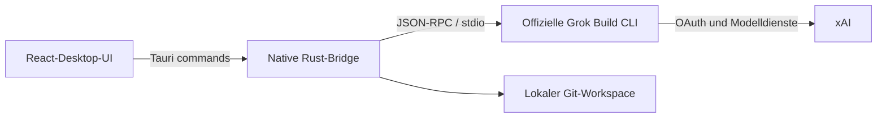

<p align="center">
  
</p>

<h1 align="center">GrokDesk</h1>

<p align="center">Die offizielle Grok-Build-Erfahrung in einem klaren, überprüfbaren Windows-Desktop-Arbeitsbereich.</p>

<p align="center">
  <a href="README.md">简体中文</a> ·
  <a href="README.en.md">English</a> ·
  <a href="README.ja.md">日本語</a> ·
  <a href="README.ko.md">한국어</a> ·
  <strong>Deutsch</strong>
</p>

<p align="center">
  
  
  <a href="LICENSE"></a>
</p>

> [!IMPORTANT]
> GrokDesk ist ein unabhängiges, inoffizielles Open-Source-Projekt. Es besteht keine Zugehörigkeit zu, Förderung durch oder offizielle Anerkennung von xAI. „Grok“, „Grok Build“ und zugehörige Marken gehören ihren jeweiligen Rechteinhabern.


## Warum GrokDesk?

Der Agent bleibt die offizielle Grok Build CLI. GrokDesk verbessert die Desktop-Nutzung rundherum: Aufgabenverlauf, Streaming-Antworten, Pläne, Tools, Berechtigungsabfragen, Git-Änderungen und Terminal-Kontext in einem Arbeitsbereich mit drei Bereichen – ohne Authentifizierung oder Agent neu zu implementieren.

## Funktionsübersicht

| Funktion | Aktuelles Verhalten |
| --- | --- |
| Echte ACP-Sitzungen | Startet den offiziellen Prozess `grok agent stdio` und unterstützt `session/new`, `session/load`, Streaming, Abbruch und Berechtigungen |
| Optimierte Antworten | Rendert GFM-Markdown sicher: Überschriften, Listen, Aufgabenlisten, Links, Tabellen, Zitate, Inline-Code und kopierbare Codeblöcke |
| Ruhiges Lesen | Der Antwortbereich scrollt unabhängig. Nach manuellem Hochscrollen zieht Streaming nicht nach unten; „Back to latest“ aktiviert die Verfolgung erneut |
| Fixiertes Tools-Dock | Tools bleiben direkt über dem Eingabefeld, zeigen standardmäßig die letzten fünf Einträge und lassen sich vollständig aufklappen |
| Dateien und Bilder | Mehrfachauswahl, Drag-and-drop, Vorschau, Entfernen und Nachrichten nur mit Anhang; echte Übertragung als ACP-image/resource |
| Workspace-Review | Explizite Ordnerwahl, echter Git-Status und Unified Diff, stage/unstage pro Datei sowie bestätigtes Zurücksetzen |
| Echtes Workspace-Terminal | Führt PowerShell im gewählten Projekt aus, zeigt stdout/stderr live und unterstützt Befehlsverlauf, Prozessbaum-Abbruch sowie eine getrennte ACP-Logansicht |
| Runtime und Anmeldung | Ein-Klick-Installation der offiziellen Grok Runtime und Anmeldung über `grok login --oauth` |
| Plugins und MCP | Liest und verwaltet reale Plugin-, Marketplace- und MCP-Daten der offiziellen Runtime |
| Lokaler Aufgabenverlauf | Speichert Aufgaben, Nachrichten, Pläne, Tools und ACP Session IDs pro Workspace; Anhangsinhalte werden nicht gespeichert |
| Desktop-Shell | Einzelinstanz, verstellbare Bereiche, einklappbarer Inspector, Light/Dark/System und Windows-Desktopverknüpfung |

### Grenzen für Anhänge

- Bis zu 8 Anhänge, 8 MiB pro Datei und 24 MiB insgesamt.
- Bilder verwenden ACP-`image`; Text und andere Dateien ACP-`resource`.
- GrokDesk liest `promptCapabilities` aus dem aktiven ACP-Initialisierungsergebnis. Fehlt die erforderliche Fähigkeit in der offiziellen Runtime, schlägt das Senden mit einer eindeutigen Meldung fehl.
- Im Aufgabenverlauf bleiben nur Dateiname, MIME-Typ, Größe und Art – niemals Dateiinhalt oder Base64-Daten.
- Die Browser-Vorschau demonstriert nur die Bedienung und sendet keine Anhänge an ein echtes Grok-Konto.

## Installation und erster Start

Windows-Nutzer können das aktuelle Installationspaket unter [GitHub Releases](https://github.com/Yueyuyu/grokdesk/releases) herunterladen. Bei der Installation wird automatisch eine GrokDesk-Desktopverknüpfung erstellt.

Beim ersten Start:

1. **Install Runtime** auswählen, um den offiziellen HTTPS-Installer von xAI auszuführen.
2. **Sign in with Grok** auswählen und OAuth im Systembrowser abschließen.
3. Einen Projektordner auswählen und anschließend eine Aufgabe erstellen oder öffnen.
4. Bei Bedarf die offizielle SuperGrok-Verwaltung über Onboarding oder Settings öffnen.

Grok Build muss nicht vorher manuell heruntergeladen oder geöffnet werden. Die offizielle CLI verwaltet OAuth-Zugangsdaten; GrokDesk speichert keine Token.

> [!NOTE]
> Abonnement- und Kontingentdaten erscheinen nur, wenn die offizielle CLI Billing-Daten liefert. Andernfalls nennt GrokDesk die Einschränkung und verlinkt die offizielle Verwaltung, statt Werte zu erfinden.

## Architektur



Die native Schicht verwaltet Prozesslebenszyklus, ACP-Nachrichten, Systembrowser, Runtime-Installation und Git. React übernimmt Aufgaben, Unterhaltungen, Tools, Anhänge, Review und Einstellungen. Das Projekt kopiert weder den offiziellen Agent noch implementiert es einen separaten Grok-Dienst.

## Lokale Entwicklung

### Voraussetzungen

- Windows 10/11
- Node.js 20+
- Rust stable mit MSVC-Toolchain
- Visual Studio 2022 Build Tools mit **Desktop development with C++**
- WebView2 Runtime

### Starten

```powershell
npm ci
npm run tauri:dev
```

Nur die React-Oberfläche im Browser ansehen:

```powershell
npm run dev
```

Die Browser-Vorschau kennzeichnet simulierte Runtime-, Anmelde-, Tools- und Anhangsergebnisse ausdrücklich. Lokale Dateien, echte Konten und echte ACP-Sitzungen sind nur in der installierten App oder im Tauri-Entwicklungsbuild verfügbar.

### Prüfen

```powershell
npm test
npm run build
cargo check --manifest-path src-tauri/Cargo.toml
npm run tauri:build
```

Pakete werden unter `src-tauri/target/release/bundle/` erzeugt.

## Datenschutz und Sicherheit

- OAuth-Zugangsdaten werden von der offiziellen Grok CLI gespeichert und aktualisiert.
- GrokDesk liest, zeigt oder speichert keine OAuth-Token.
- Die Runtime-Installation führt `https://x.ai/cli/install.ps1` nur nach einem ausdrücklichen Klick aus.
- ACP- und Git-Aktionen sind auf den vom Nutzer ausgewählten Ordner begrenzt.
- Das Workspace-Terminal führt nur ausdrücklich eingegebene Befehle aus; die Ausgabe bleibt in der aktuellen App-Sitzung und wird nicht im Aufgabenverlauf gespeichert.
- Anhangsinhalte werden nur für die aktuelle Anfrage kodiert und nicht im Aufgabenverlauf gespeichert.
- Das Zurücksetzen einer Datei erfordert immer eine Bestätigung; es gibt kein automatisches Massen-Rollback.
- Rohes HTML ist in Markdown deaktiviert; externe Links verwenden ein isoliertes neues Fenster.

## Aktuelle Grenzen und Roadmap

- Windows hat Priorität; offizielle Pakete für macOS und Linux gibt es noch nicht.
- Die Ein-Klick-Installation der Runtime ist derzeit nur unter Windows verfügbar.
- Anhänge hängen letztlich von den ACP-Fähigkeiten der installierten offiziellen Runtime ab.
- Abonnement und Kontingent hängen von der Billing-Methode der offiziellen CLI ab.
- Strukturierte Testergebnisse, geräteübergreifende Synchronisierung und ein umfangreicherer Sitzungsexport sind geplant.

## Mitwirken

Issues und Pull Requests sind willkommen. Bitte jeden PR auf eine logische Änderung begrenzen und zuvor die relevanten Tests sowie den Build ausführen. Keine Token, Kontodaten oder privaten Workspace-Inhalte in öffentlichen Issues veröffentlichen.

## Designreferenzen

- [Visuelle Vorlage](docs/design/grokdesk-light-concept.png)
- [Implementierungsinventar](docs/design/implementation-inventory.md)
- [Visual-QA-Notizen](design-qa.md)
- [Imagegen-Asset-Notizen](docs/design/imagegen-assets.md)

## License

[MIT](LICENSE)
