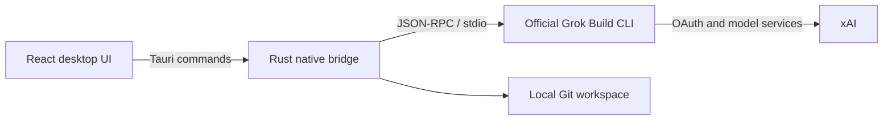

<p align="center">
  
</p>

<h1 align="center">GrokDesk</h1>

<p align="center">Bring the official Grok Build experience into a clear, reviewable Windows desktop workspace.</p>

<p align="center">
  <a href="README.md">简体中文</a> ·
  <strong>English</strong> ·
  <a href="README.ja.md">日本語</a> ·
  <a href="README.ko.md">한국어</a> ·
  <a href="README.de.md">Deutsch</a>
</p>

<p align="center">
  <a href="https://github.com/Yueyuyu/grokdesk/releases/latest"></a>
  <a href="https://github.com/Yueyuyu/grokdesk/actions/workflows/ci.yml"></a>
  <a href="https://github.com/Yueyuyu/grokdesk/stargazers"></a>
  <a href="https://github.com/Yueyuyu/grokdesk/forks"></a>
  <a href="https://github.com/Yueyuyu/grokdesk/issues"></a>
  <a href="https://github.com/Yueyuyu/grokdesk/releases"></a>
  <a href="LICENSE"></a>
</p>

<p align="center">
  <a href="https://github.com/Yueyuyu/grokdesk/releases/latest"><strong>Download latest</strong></a> ·
  <a href="#highlights">Features</a> ·
  <a href="#install-and-first-launch">Install</a> ·
  <a href="#local-development">Develop</a> ·
  <a href="#current-limits-and-roadmap">Roadmap</a>
</p>

<p align="center">
  
  
  
  
  
  
</p>

> [!IMPORTANT]
> GrokDesk is an independent, unofficial open-source project. It is not affiliated with, sponsored by, or endorsed by xAI. “Grok,” “Grok Build,” and related trademarks belong to their respective owners.


## Why GrokDesk

The agent itself remains the official Grok Build CLI. GrokDesk focuses on the desktop experience around it: task history, streaming responses, plans, tool activity, permission requests, Git changes, and terminal context in one three-pane workspace—without taking over authentication or reimplementing the agent.

## Highlights

| Capability | Current behavior |
| --- | --- |
| Real ACP sessions | Runs the official `grok agent stdio` process with `session/new`, `session/load`, streaming updates, cancellation, and permission handling |
| Background ACP tasks | Keeps up to four task-scoped official Runtime clients. Startup is serialized to avoid the current CLI's concurrent-initialization stall, then initialized tasks run in parallel; switching or creating tasks does not interrupt output, and completion, failure, or permission notifications open the correct task |
| Polished responses | Safely renders GFM Markdown: headings, lists, task lists, links, tables, quotes, inline code, and copyable code blocks |
| Stable reading | The response pane scrolls independently; streaming does not pull users away after they scroll up, and “Back to latest” restores follow mode |
| Docked Tools | Tool activity stays directly above the composer, shows the five latest items, and expands to the full activity list |
| Files and images | Multi-select, drag and drop, previews, removal, and attachment-only prompts; content is sent as real ACP image or resource blocks |
| Workspace review | Explicit project-folder selection, real Git status and unified diffs, per-file stage/unstage, and confirmed revert |
| Real workspace terminal | Runs PowerShell in the selected project with live stdout/stderr, command history, process-tree cancellation, and a separate ACP log view |
| Background terminals and test results | Runs up to eight independent terminal tabs concurrently; tabs can be created, renamed, closed, and stopped individually, while real Vitest, Cargo, Jest, and Node output is parsed into pass, failure, and duration summaries |
| Runtime and sign-in | One-click installation of the official Grok Runtime and authentication through `grok login --oauth` |
| Plugins and MCP | Reads and manages real Plugin, Marketplace, and MCP state exposed by the official Runtime |
| Runtime context and Skills | Reads project instructions, Skills, Agents, and configuration layers for the current workspace through official `grok inspect --json`, then combines capabilities reported by the active ACP session; supports refresh and explicit ACP reconnect, with no simulated browser records |
| Model and reasoning profiles | Shows models, context windows, and reasoning efforts only from official ACP initialization metadata, then launches tasks through the official `--model` and `--reasoning-effort` arguments; tasks with saved conversation are never restarted silently |
| Local task history | Stores tasks, messages, plans, tools, and ACP session IDs per workspace; attachment contents are never stored |
| Task lifecycle | Archives and restores tasks, creates local branches with a fresh ACP session, and explicitly imports/exports strictly validated JSON up to 8 MiB without credentials or attachment bodies |
| Command palette and cross-task search | Press `Ctrl+K` to search active and archived tasks in the current workspace across titles, conversations, attachment names, plans, and tools, or run navigation, task, workspace, and inspector commands |
| Permissions and execution audit | Records redacted permission decisions, Grok tool lifecycles, and terminal command outcomes per workspace, with filters, search, and confirmed clearing; browser previews never generate simulated audit records |
| Diagnostics and support reports | Runs real checks for GrokDesk, Runtime, OAuth, ACP, workspace/Git, and MCP, with actionable recovery links and a sanitized Markdown export; browser previews never invent health data |
| Desktop shell | Single instance, resizable panes, collapsible inspector, Light/Dark/System themes, and a Windows desktop shortcut |

### Attachment boundaries

- Up to 8 attachments, 8 MiB per file, and 24 MiB total.
- Images use ACP `image` blocks; text and other files use ACP `resource` blocks.
- GrokDesk reads `promptCapabilities` from the active ACP initialization result. If the official Runtime does not advertise the required capability, sending fails explicitly.
- Task history keeps only attachment name, MIME type, size, and kind—never file text or Base64 data.
- Browser preview demonstrates the interaction but does not send attachments to a real Grok account.

## Install and first launch

Windows users can download the latest installer from [GitHub Releases](https://github.com/Yueyuyu/grokdesk/releases). Installation automatically creates a GrokDesk desktop shortcut.

On first launch:

1. Select **Install Runtime** to run xAI's official HTTPS installer.
2. Select **Sign in with Grok** and complete official OAuth in the system browser.
3. Choose a project folder, then create or open a task.
4. Open the official SuperGrok management page from Onboarding or Settings when needed.

You do not need to download or open Grok Build manually first. The official CLI owns OAuth credentials; GrokDesk does not store tokens.

> [!NOTE]
> Subscription and quota information appears only when the official CLI returns billing data. Otherwise, GrokDesk states the limitation and links to the official management page instead of inventing a tier or usage value.

## How it works



The native layer owns process lifecycle, ACP messaging, system-browser launch, Runtime installation, and Git operations. React owns tasks, conversations, tools, attachments, review, and settings. The project neither copies the official agent nor implements a separate Grok service.

## Local development

### Requirements

- Windows 10/11
- Node.js 20+
- Rust stable with the MSVC toolchain
- Visual Studio 2022 Build Tools with **Desktop development with C++**
- WebView2 Runtime

### Run

```powershell
npm ci
npm run tauri:dev
```

React-only browser preview:

```powershell
npm run dev
```

The browser preview explicitly labels simulated Runtime, sign-in, Tools, and attachment results. Local files, real accounts, and real ACP sessions are accessed only by the installed app or Tauri development build.

### Validate

```powershell
npm test
npm run build
cargo check --manifest-path src-tauri/Cargo.toml
npm run tauri:build
```

Bundles are written to `src-tauri/target/release/bundle/`.

## Privacy and security

- OAuth credentials are stored and refreshed by the official Grok CLI.
- GrokDesk does not read, display, or persist OAuth tokens.
- Runtime installation runs `https://x.ai/cli/install.ps1` only after an explicit click.
- ACP and Git operations are scoped to the folder the user explicitly selected.
- The workspace terminal runs only commands explicitly entered by the user; raw output and structured test summaries stay in the current app session and are not written to task history.
- Attachment content is encoded only for the current turn and is not stored in task history.
- Task JSON is imported or exported only after an explicit user action. It may contain conversations, file names, and workspace paths, but never OAuth/MCP credentials, ACP session IDs, or attachment bodies.
- The command palette searches only local tasks in the current workspace; queries and results are never uploaded to an external service.
- Permission and execution history stays local and workspace-scoped, with a 30-day and 500-record limit. Terminal output, prompts, responses, attachment bodies, OAuth tokens, and MCP headers are excluded, while sensitive command arguments are redacted before persistence.
- Diagnostic reports contain only versions, platform details, aggregate counts, and controlled status text. Absolute paths, account identifiers, prompts, responses, terminal output, attachments, OAuth credentials, and MCP names, endpoints, or headers are excluded or redacted.
- The Context inspector exposes only a safe projection of official Runtime output; credential values, absolute source paths, and MCP names, endpoints, or headers never enter frontend data.
- Model profiles persist only validated model IDs and reasoning-effort identifiers. The catalog comes from the official Runtime, browser previews never fabricate it, and no account credentials are read or stored.
- File revert always requires confirmation; there is no automatic bulk rollback.
- Raw HTML is disabled in Markdown, and external links use isolated new-window behavior.

## Current limits and roadmap

- Windows is the priority platform; no official macOS or Linux bundle is available yet.
- One-click Runtime installation is currently Windows-only.
- Attachment support ultimately depends on the installed official Runtime's ACP capabilities.
- Subscription and quota display depends on the official CLI's billing method.
- The terminal currently runs non-interactive PowerShell commands rather than a full PTY/TTY session.
- Skills are currently read-only in the Context inspector. The official CLI exposes discovery but no standalone Skills management command, so installation and updates remain owned by the containing Plugin.
- Cross-device sync remains planned work.

## Contributing

Issues and pull requests are welcome. Keep each PR focused on one logical change and run the relevant tests and build before submission. Never include tokens, account information, or private workspace content in a public issue.

## Design references

- [Visual source](docs/design/grokdesk-light-concept.png)
- [Implementation inventory](docs/design/implementation-inventory.md)
- [Visual QA notes](design-qa.md)
- [Imagegen asset notes](docs/design/imagegen-assets.md)

## License

[MIT](LICENSE)
