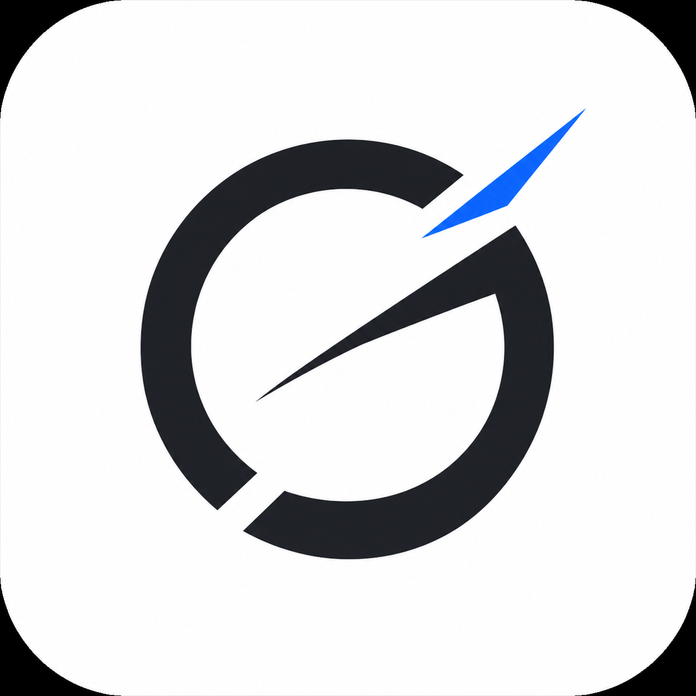
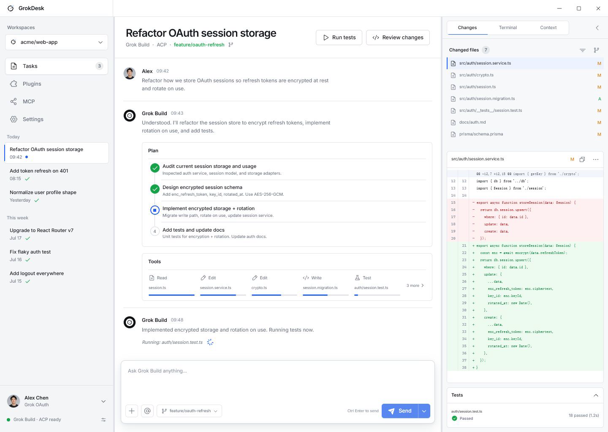
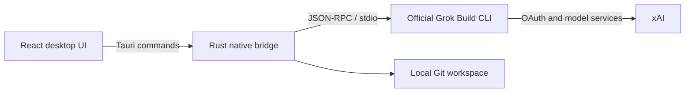

<p align="center">
  
</p>

<h1 align="center">GrokDesk</h1>

<p align="center">Bring the official Grok Build experience into a clear, reviewable Windows desktop workspace.</p>

<p align="center">
  <a href="README.md">简体中文</a> ·
  <strong>English</strong> ·
  <a href="README.ja.md">日本語</a> ·
  <a href="README.ko.md">한국어</a> ·
  <a href="README.de.md">Deutsch</a>
</p>

<p align="center">
  
  
  <a href="LICENSE"></a>
</p>

> [!IMPORTANT]
> GrokDesk is an independent, unofficial open-source project. It is not affiliated with, sponsored by, or endorsed by xAI. “Grok,” “Grok Build,” and related trademarks belong to their respective owners.



## Why GrokDesk

The agent itself remains the official Grok Build CLI. GrokDesk focuses on the desktop experience around it: task history, streaming responses, plans, tool activity, permission requests, Git changes, and terminal context in one three-pane workspace—without taking over authentication or reimplementing the agent.

## Highlights

| Capability | Current behavior |
| --- | --- |
| Real ACP sessions | Runs the official `grok agent stdio` process with `session/new`, `session/load`, streaming updates, cancellation, and permission handling |
| Polished responses | Safely renders GFM Markdown: headings, lists, task lists, links, tables, quotes, inline code, and copyable code blocks |
| Stable reading | The response pane scrolls independently; streaming does not pull users away after they scroll up, and “Back to latest” restores follow mode |
| Docked Tools | Tool activity stays directly above the composer, shows the five latest items, and expands to the full activity list |
| Files and images | Multi-select, drag and drop, previews, removal, and attachment-only prompts; content is sent as real ACP image or resource blocks |
| Workspace review | Explicit project-folder selection, real Git status and unified diffs, per-file stage/unstage, and confirmed revert |
| Real workspace terminal | Runs PowerShell in the selected project with live stdout/stderr, command history, process-tree cancellation, and a separate ACP log view |
| Runtime and sign-in | One-click installation of the official Grok Runtime and authentication through `grok login --oauth` |
| Plugins and MCP | Reads and manages real Plugin, Marketplace, and MCP state exposed by the official Runtime |
| Local task history | Stores tasks, messages, plans, tools, and ACP session IDs per workspace; attachment contents are never stored |
| Desktop shell | Single instance, resizable panes, collapsible inspector, Light/Dark/System themes, and a Windows desktop shortcut |

### Attachment boundaries

- Up to 8 attachments, 8 MiB per file, and 24 MiB total.
- Images use ACP `image` blocks; text and other files use ACP `resource` blocks.
- GrokDesk reads `promptCapabilities` from the active ACP initialization result. If the official Runtime does not advertise the required capability, sending fails explicitly.
- Task history keeps only attachment name, MIME type, size, and kind—never file text or Base64 data.
- Browser preview demonstrates the interaction but does not send attachments to a real Grok account.

## Install and first launch

Windows users can download the latest installer from [GitHub Releases](https://github.com/Yueyuyu/grokdesk/releases). Installation automatically creates a GrokDesk desktop shortcut.

On first launch:

1. Select **Install Runtime** to run xAI's official HTTPS installer.
2. Select **Sign in with Grok** and complete official OAuth in the system browser.
3. Choose a project folder, then create or open a task.
4. Open the official SuperGrok management page from Onboarding or Settings when needed.

You do not need to download or open Grok Build manually first. The official CLI owns OAuth credentials; GrokDesk does not store tokens.

> [!NOTE]
> Subscription and quota information appears only when the official CLI returns billing data. Otherwise, GrokDesk states the limitation and links to the official management page instead of inventing a tier or usage value.

## How it works



The native layer owns process lifecycle, ACP messaging, system-browser launch, Runtime installation, and Git operations. React owns tasks, conversations, tools, attachments, review, and settings. The project neither copies the official agent nor implements a separate Grok service.

## Local development

### Requirements

- Windows 10/11
- Node.js 20+
- Rust stable with the MSVC toolchain
- Visual Studio 2022 Build Tools with **Desktop development with C++**
- WebView2 Runtime

### Run

```powershell
npm ci
npm run tauri:dev
```

React-only browser preview:

```powershell
npm run dev
```

The browser preview explicitly labels simulated Runtime, sign-in, Tools, and attachment results. Local files, real accounts, and real ACP sessions are accessed only by the installed app or Tauri development build.

### Validate

```powershell
npm test
npm run build
cargo check --manifest-path src-tauri/Cargo.toml
npm run tauri:build
```

Bundles are written to `src-tauri/target/release/bundle/`.

## Privacy and security

- OAuth credentials are stored and refreshed by the official Grok CLI.
- GrokDesk does not read, display, or persist OAuth tokens.
- Runtime installation runs `https://x.ai/cli/install.ps1` only after an explicit click.
- ACP and Git operations are scoped to the folder the user explicitly selected.
- The workspace terminal runs only commands explicitly entered by the user; output stays in the current app session and is not written to task history.
- Attachment content is encoded only for the current turn and is not stored in task history.
- File revert always requires confirmation; there is no automatic bulk rollback.
- Raw HTML is disabled in Markdown, and external links use isolated new-window behavior.

## Current limits and roadmap

- Windows is the priority platform; no official macOS or Linux bundle is available yet.
- One-click Runtime installation is currently Windows-only.
- Attachment support ultimately depends on the installed official Runtime's ACP capabilities.
- Subscription and quota display depends on the official CLI's billing method.
- Structured test-result capture, cross-device sync, and richer session export remain planned work.

## Contributing

Issues and pull requests are welcome. Keep each PR focused on one logical change and run the relevant tests and build before submission. Never include tokens, account information, or private workspace content in a public issue.

## Design references

- [Visual source](docs/design/grokdesk-light-concept.png)
- [Implementation inventory](docs/design/implementation-inventory.md)
- [Visual QA notes](design-qa.md)
- [Imagegen asset notes](docs/design/imagegen-assets.md)

## License

[MIT](LICENSE)
