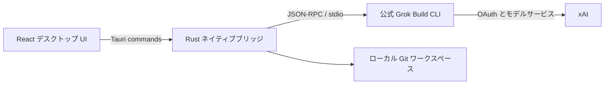

<p align="center">
  
</p>

<h1 align="center">GrokDesk</h1>

<p align="center">公式 Grok Build を、見やすくレビュー可能な Windows デスクトップ・ワークスペースへ。</p>

<p align="center">
  <a href="README.md">简体中文</a> ·
  <a href="README.en.md">English</a> ·
  <strong>日本語</strong> ·
  <a href="README.ko.md">한국어</a> ·
  <a href="README.de.md">Deutsch</a>
</p>

<p align="center">
  
  
  <a href="LICENSE"></a>
</p>

> [!IMPORTANT]
> GrokDesk は独立した非公式のオープンソースプロジェクトです。xAI との提携、後援、公式承認はありません。「Grok」「Grok Build」および関連する商標は、それぞれの権利者に帰属します。


## GrokDesk の目的

Agent 本体には公式 Grok Build CLI をそのまま使用します。GrokDesk は、タスク履歴、ストリーミング応答、プラン、Tools、権限確認、Git 変更、ターミナル情報を1つの3ペイン画面にまとめ、認証や Agent を独自実装せずにデスクトップ体験を改善します。

## 主な機能

| 機能 | 現在の動作 |
| --- | --- |
| 実 ACP セッション | 公式 `grok agent stdio` を起動し、`session/new`、`session/load`、ストリーミング、キャンセル、権限確認に対応 |
| 読みやすい応答 | GFM Markdown の見出し、リスト、タスクリスト、リンク、表、引用、インラインコード、コピー可能なコードブロックを安全に表示 |
| 安定したスクロール | 応答領域は独立してスクロールし、上に戻った後はストリーミングで強制的に最下部へ移動しません。「Back to latest」で追従を再開できます |
| 固定 Tools ドック | Tools は入力欄の上に固定され、直近5件を表示。必要に応じて全件を展開できます |
| ファイルと画像 | 複数選択、ドラッグ＆ドロップ、プレビュー、削除、添付のみの送信に対応。ACP の image/resource として実際に送信 |
| ワークスペースレビュー | 明示的なフォルダー選択、実 Git ステータスと Unified Diff、ファイル単位の stage/unstage、確認付き revert |
| 実ワークスペースターミナル | 選択したプロジェクトで PowerShell を実行し、stdout/stderr、コマンド履歴、プロセスツリー停止、独立した ACP ログ表示に対応 |
| Runtime とログイン | 公式 Grok Runtime のワンクリック導入と `grok login --oauth` による認証 |
| Plugins と MCP | 公式 Runtime が公開する実際の Plugin、Marketplace、MCP 設定を表示・管理 |
| ローカル履歴 | ワークスペース単位でタスク、メッセージ、プラン、Tools、ACP Session ID を保存。添付内容は保存しません |
| デスクトップシェル | 単一インスタンス、幅調整可能な3ペイン、折りたたみ可能なインスペクター、Light/Dark/System テーマ、デスクトップショートカット |

### 添付ファイルの制限

- 最大8件、1ファイル8 MiB、合計24 MiBまで。
- 画像は ACP `image`、テキストやその他のファイルは ACP `resource` を使用します。
- ACP 初期化結果の `promptCapabilities` を確認し、公式 Runtime が必要な機能を公開していない場合は明確なエラーを表示します。
- 履歴に保存するのはファイル名、MIME、サイズ、種類のみで、本文や Base64 データは保存しません。
- ブラウザプレビューは操作のデモのみで、実際の Grok アカウントへ添付を送信しません。

## インストールと初回起動

Windows 版は [GitHub Releases](https://github.com/Yueyuyu/grokdesk/releases) からダウンロードできます。インストール時に GrokDesk のデスクトップショートカットが自動作成されます。

初回起動時：

1. **Install Runtime** を選び、xAI 公式の HTTPS インストーラーを実行します。
2. **Sign in with Grok** を選び、システムブラウザで公式 OAuth を完了します。
3. プロジェクトフォルダーを選び、タスクを作成または開きます。
4. 必要に応じて Onboarding または Settings から公式 SuperGrok 管理ページを開きます。

Grok Build を事前に手動ダウンロードする必要はありません。OAuth 資格情報は公式 CLI が管理し、GrokDesk は Token を保存しません。

> [!NOTE]
> 契約プランと利用量は、公式 CLI が billing データを返した場合のみ表示されます。利用できない場合は制限を明示し、架空の値ではなく公式管理ページへのリンクを表示します。

## 仕組み



ネイティブ層はプロセス、ACP、システムブラウザ、Runtime 導入、Git 操作を担当し、React 層はタスク、会話、Tools、添付、レビュー、設定を担当します。公式 Agent を複製したり、別の Grok サービスを実装したりしません。

## ローカル開発

### 必要環境

- Windows 10/11
- Node.js 20+
- Rust stable（MSVC toolchain）
- Visual Studio 2022 Build Tools の **Desktop development with C++**
- WebView2 Runtime

### 起動

```powershell
npm ci
npm run tauri:dev
```

React UI のみをブラウザで確認する場合：

```powershell
npm run dev
```

ブラウザプレビューでは Runtime、ログイン、Tools、添付結果がシミュレーションであることを明示します。実ファイル、実アカウント、実 ACP へアクセスするのはインストール版または Tauri 開発版のみです。

### 検証

```powershell
npm test
npm run build
cargo check --manifest-path src-tauri/Cargo.toml
npm run tauri:build
```

生成物は `src-tauri/target/release/bundle/` に出力されます。

## プライバシーと安全性

- OAuth 資格情報は公式 Grok CLI が保存・更新します。
- GrokDesk は OAuth Token を読み取り、表示、永続化しません。
- Runtime の導入は、ユーザーの明示操作後にのみ公式 `https://x.ai/cli/install.ps1` を実行します。
- ACP と Git 操作は、ユーザーが選んだフォルダーに限定されます。
- ワークスペースターミナルはユーザーが明示的に入力したコマンドだけを実行し、出力は現在のアプリセッション内にのみ保持されます。
- 添付内容は現在の送信ターンでのみエンコードされ、タスク履歴には保存されません。
- ファイルの revert は必ず確認を要求し、自動一括ロールバックは行いません。
- Markdown の生 HTML は無効で、外部リンクは分離された新規ウィンドウで開きます。

## 現在の制限とロードマップ

- 現在は Windows を優先しており、macOS/Linux の正式パッケージはまだありません。
- Runtime のワンクリック導入は Windows のみです。
- 添付対応は、インストール済みの公式 Runtime が公開する ACP 機能に依存します。
- 契約プランと利用量は、公式 CLI の billing メソッドに依存します。
- テスト結果の構造化収集、デバイス間同期、より完全なセッションエクスポートは今後の予定です。

## コントリビューション

Issue と Pull Request を歓迎します。1つの PR は1つの論理変更に絞り、送信前に関連テストとビルドを実行してください。公開 Issue に Token、アカウント情報、非公開ワークスペースの内容を添付しないでください。

## デザイン資料

- [ビジュアルソース](docs/design/grokdesk-light-concept.png)
- [実装インベントリ](docs/design/implementation-inventory.md)
- [ビジュアル QA](design-qa.md)
- [Imagegen アセットノート](docs/design/imagegen-assets.md)

## License

[MIT](LICENSE)
