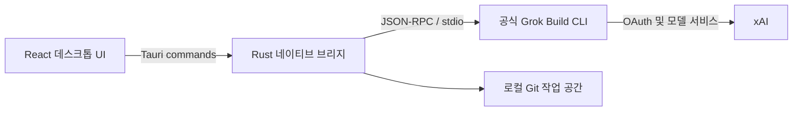

<p align="center">
  
</p>

<h1 align="center">GrokDesk</h1>

<p align="center">공식 Grok Build를 명확하고 검토 가능한 Windows 및 macOS 데스크톱 작업 공간에서 사용하세요.</p>

<p align="center">
  <a href="README.md">简体中文</a> ·
  <a href="README.en.md">English</a> ·
  <a href="README.ja.md">日本語</a> ·
  <strong>한국어</strong> ·
  <a href="README.de.md">Deutsch</a>
</p>

<p align="center">
  <a href="https://github.com/Yueyuyu/grokdesk/releases/latest"></a>
  <a href="https://github.com/Yueyuyu/grokdesk/actions/workflows/ci.yml"></a>
  <a href="https://github.com/Yueyuyu/grokdesk/stargazers"></a>
  <a href="https://github.com/Yueyuyu/grokdesk/forks"></a>
  <a href="https://github.com/Yueyuyu/grokdesk/issues"></a>
  <a href="https://github.com/Yueyuyu/grokdesk/releases"></a>
  <a href="LICENSE"></a>
</p>

<p align="center">
  <a href="https://github.com/Yueyuyu/grokdesk/releases/latest"><strong>최신 버전 다운로드</strong></a> ·
  <a href="#주요-기능">기능</a> ·
  <a href="#설치와-첫-실행">설치</a> ·
  <a href="#로컬-개발">개발</a> ·
  <a href="#현재-제한과-로드맵">로드맵</a>
</p>

<p align="center">
  
  
  
  
  
  
  
</p>

> [!IMPORTANT]
> GrokDesk는 독립적인 비공식 오픈 소스 프로젝트입니다. xAI와 제휴하거나 후원 또는 공식 승인을 받은 프로젝트가 아닙니다. “Grok”, “Grok Build” 및 관련 상표의 권리는 각 소유자에게 있습니다.


## GrokDesk를 만드는 이유

Agent 자체는 공식 Grok Build CLI를 그대로 사용합니다. GrokDesk는 인증이나 Agent를 다시 구현하지 않고, 작업 기록, 스트리밍 응답, 계획, Tools, 권한 확인, Git 변경 사항과 터미널 문맥을 하나의 3개 패널 데스크톱 환경에 모읍니다.

## 주요 기능

| 기능 | 현재 동작 |
| --- | --- |
| 실제 ACP 세션 | 공식 `grok agent stdio`를 실행하고 `session/new`, `session/load`, 스트리밍 업데이트, 취소, 권한 확인을 지원 |
| 백그라운드 ACP 작업 | 작업별 공식 Runtime 클라이언트를 최대 4개 유지함. 현재 CLI의 동시 초기화 중단을 피하기 위해 시작 단계는 직렬화하고 초기화 후에는 병렬 실행함. 작업 전환이나 새 작업 생성으로 출력이 중단되지 않으며 완료, 실패, 권한 요청 알림에서 원래 작업을 바로 열 수 있음 |
| 최적화된 응답 | GFM Markdown의 제목, 목록, 작업 목록, 링크, 표, 인용문, 인라인 코드와 복사 가능한 코드 블록을 안전하게 렌더링 |
| 안정적인 읽기 | 응답 영역이 독립적으로 스크롤되며, 사용자가 위로 이동한 뒤에는 스트리밍 출력이 강제로 아래로 끌어내리지 않음. “Back to latest”로 추적 재개 |
| 고정 Tools 도크 | Tools를 입력창 바로 위에 고정하고 최근 5개를 기본 표시하며 전체 활동을 펼쳐 볼 수 있음 |
| 파일과 이미지 | 다중 선택, 드래그 앤 드롭, 미리 보기, 제거, 첨부 전용 전송을 지원하며 실제 ACP image/resource로 전송 |
| 작업 공간 검토 | 프로젝트 폴더 명시 선택, 실제 Git 상태와 Unified Diff, 파일별 stage/unstage, 확인 후 revert |
| 실제 작업 공간 터미널 | 선택한 프로젝트에서 Windows PowerShell 또는 macOS 사용자 Shell을 실행하고 stdout/stderr, 명령 기록, 프로세스 트리 중지, 별도 ACP 로그 보기를 지원 |
| 백그라운드 터미널과 테스트 결과 | 최대 8개의 독립 터미널 탭을 병렬 실행하고 생성, 이름 변경, 닫기, 탭별 중지를 지원하며 실제 Vitest, Cargo, Jest, Node 출력에서 통과, 실패, 소요 시간 요약을 추출 |
| Runtime과 로그인 | Windows 및 macOS에서 공식 Grok Runtime 원클릭 설치와 `grok login --oauth` 인증 지원 |
| 계정과 로컬 활동 | 전용 Account 화면은 공식 Runtime이 실제로 반환한 구독, 할당량, 기간만 표시하고 현재 작업 공간의 로컬 활동 히트맵과 최근 작업을 xAI 계정 전체 사용량과 명확히 구분 |
| Plugins와 MCP | 공식 Runtime이 제공하는 실제 Plugin, Marketplace, MCP 구성을 조회하고 관리 |
| Runtime 컨텍스트와 Skills | 공식 `grok inspect --json`으로 현재 작업 공간의 프로젝트 지침, Skills, Agents, 구성 레이어를 읽고 활성 ACP 세션이 보고한 기능을 결합함. 새로 고침과 명시적 ACP 재연결을 지원하며 브라우저 기록을 모의 생성하지 않음 |
| 모델 및 추론 프로필 | 공식 ACP 초기화 메타데이터에서만 모델, 컨텍스트 창, 추론 강도를 표시하고 공식 `--model`, `--reasoning-effort` 인수로 작업을 시작함. 저장된 대화가 있는 작업은 자동으로 다시 시작하지 않음 |
| 로컬 작업 기록 | 작업 공간별로 작업, 메시지, 계획, Tools, ACP Session ID를 저장하며 첨부 내용은 저장하지 않음 |
| 작업 수명 주기 | 작업 보관/복원, 새 ACP Session을 사용하는 로컬 분기, 8 MiB 제한과 엄격한 구조 검증을 거친 JSON의 명시적 가져오기/내보내기를 지원하며 자격 증명과 첨부 본문은 포함하지 않음 |
| 명령 팔레트와 작업 간 검색 | `Ctrl+K`로 현재 작업 공간의 일반/보관 작업을 제목, 대화, 첨부 이름, 계획, Tools에서 검색하고 탐색, 작업 생성, 작업 공간 전환, Inspector 명령을 실행 |
| 권한 센터와 실행 감사 | 작업 공간별로 마스킹된 권한 결정, Grok 도구 수명 주기, 터미널 명령 결과를 기록하며 필터, 검색, 확인 후 삭제를 지원하고 브라우저 미리보기에서는 감사 기록을 모의 생성하지 않음 |
| 진단 센터와 지원 보고서 | GrokDesk, Runtime, OAuth, ACP, 작업 공간/Git, MCP를 실제로 점검하고 실행 가능한 복구 경로와 마스킹된 Markdown 보고서를 제공하며 브라우저 미리보기에서는 상태 데이터를 모의 생성하지 않음 |
| 데스크톱 셸 | 단일 인스턴스, 크기 조절 가능한 3개 패널, 접이식 Inspector, Light/Dark/System 테마, Windows 바탕 화면 바로 가기, macOS 기본 신호등 창 버튼 |

### 첨부 파일 제한

- 최대 8개, 파일당 8 MiB, 전체 24 MiB까지 지원합니다.
- 이미지는 ACP `image`, 텍스트와 기타 파일은 ACP `resource` 블록을 사용합니다.
- 활성 ACP 초기화 결과의 `promptCapabilities`를 확인합니다. 공식 Runtime이 필요한 기능을 제공하지 않으면 전송 실패를 명확히 표시합니다.
- 작업 기록에는 파일 이름, MIME 유형, 크기와 종류만 저장하며 본문이나 Base64 데이터는 저장하지 않습니다.
- 브라우저 미리 보기는 인터페이스만 시연하며 실제 Grok 계정으로 첨부 파일을 보내지 않습니다.

## 설치와 첫 실행

[GitHub Releases](https://github.com/Yueyuyu/grokdesk/releases)에서 플랫폼에 맞는 패키지를 다운로드하세요.

| 플랫폼 | 패키지 | 설명 |
| --- | --- | --- |
| Windows 10/11 x64 | `.exe` 또는 `.msi` | 설치 후 GrokDesk 바탕 화면 바로 가기를 자동 생성 |
| macOS Apple Silicon | Apple Silicon / `aarch64` `.dmg` | M1, M2, M3, M4 및 이후 Apple 칩용 |
| macOS Intel | Intel / `x86_64` `.dmg` | Intel Mac용 |

현재 macOS 빌드는 서명 및 공증되지 않았습니다. Gatekeeper가 첫 실행을 막으면 Finder에서 GrokDesk를 우클릭해 **열기**를 선택하거나 **시스템 설정 → 개인정보 보호 및 보안 → 그래도 열기**를 사용하세요. 이 저장소의 Release에서만 다운로드하고 같은 Release의 `SHA256SUMS.txt`로 검증하세요.

첫 실행 순서:

1. **Install Runtime**을 선택해 xAI 공식 HTTPS 설치 프로그램을 실행합니다.
2. **Sign in with Grok**을 선택하고 시스템 브라우저에서 공식 OAuth를 완료합니다.
3. 프로젝트 폴더를 선택한 뒤 작업을 만들거나 엽니다.
4. 필요하면 Onboarding 또는 Settings에서 공식 SuperGrok 관리 페이지를 엽니다.

Grok Build를 먼저 수동으로 내려받거나 실행할 필요가 없습니다. OAuth 자격 증명은 공식 CLI가 관리하며 GrokDesk는 Token을 저장하지 않습니다.

> [!NOTE]
> 구독과 사용량은 공식 CLI가 billing 데이터를 실제로 반환할 때만 표시됩니다. 그렇지 않으면 GrokDesk는 제한을 명확히 알리고 가짜 값 대신 공식 관리 페이지를 제공합니다.

## 작동 방식



네이티브 계층은 프로세스 수명 주기, ACP 메시지, 시스템 브라우저, Runtime 설치와 Git 작업을 담당합니다. React 계층은 작업, 대화, Tools, 첨부, 검토와 설정을 담당합니다. 공식 Agent를 복제하거나 별도의 Grok 서비스를 구현하지 않습니다.

## 로컬 개발

### 요구 사항

- Windows 10/11 또는 macOS 13+
- Node.js 20+
- Rust stable
- Windows: MSVC toolchain, **Desktop development with C++**가 포함된 Visual Studio 2022 Build Tools, WebView2 Runtime
- macOS: Xcode Command Line Tools

### 실행

```bash
npm ci
npm run tauri:dev
```

React UI만 브라우저에서 미리 보기:

```bash
npm run dev
```

브라우저 미리 보기에는 Runtime, Tools 및 첨부 결과가 시뮬레이션임을 명확히 표시합니다. Account 화면은 가짜 계정, 할당량 또는 활동 데이터를 만들지 않습니다. 로컬 파일, 실제 계정, 실제 ACP는 설치 버전 또는 Tauri 개발 버전에서만 접근합니다.

### 검증

```bash
npm test
npm run build
cargo check --manifest-path src-tauri/Cargo.toml
npm run tauri:build
```

Windows 번들은 `src-tauri/target/release/bundle/`에 생성됩니다. macOS에서는 `npm run tauri:build:mac-arm` 또는 `npm run tauri:build:mac-intel`로 해당 `.app`과 `.dmg`를 생성할 수 있습니다.

## 개인정보 보호와 보안

- OAuth 자격 증명은 공식 Grok CLI가 저장하고 갱신합니다.
- GrokDesk는 OAuth Token을 읽거나 표시하거나 영구 저장하지 않습니다.
- Runtime 설치는 사용자가 명시적으로 클릭한 뒤에만 공식 스크립트를 실행합니다. Windows는 `https://x.ai/cli/install.ps1`, macOS는 `https://x.ai/cli/install.sh`을 사용합니다.
- Account 히트맵과 최근 작업은 현재 로컬 작업 공간에 저장된 작업, 메시지, Tools만 집계합니다. OAuth Token을 읽지 않으며 xAI 계정 전체 사용량이라고 표시하지 않습니다.
- ACP와 Git 작업은 사용자가 명시적으로 선택한 폴더로 제한됩니다.
- 작업 공간 터미널은 사용자가 직접 입력한 명령만 실행하며 원시 출력과 구조화된 테스트 요약은 현재 앱 세션에만 유지되고 작업 기록에는 저장되지 않습니다.
- 첨부 내용은 현재 전송 회차에만 인코딩되며 작업 기록에 저장되지 않습니다.
- 작업 JSON은 사용자가 명시적으로 실행한 경우에만 가져오거나 내보냅니다. 대화, 파일 이름, 작업 공간 경로가 포함될 수 있지만 OAuth/MCP 자격 증명, ACP Session ID, 첨부 본문은 포함하지 않습니다.
- 명령 팔레트는 현재 작업 공간에 저장된 로컬 작업만 검색하며 검색어와 결과를 외부 서비스로 전송하지 않습니다.
- 권한 및 실행 기록은 로컬에서 작업 공간별로만 저장되며 30일, 500개로 제한됩니다. 터미널 출력, 프롬프트, 응답, 첨부 본문, OAuth Token, MCP Header는 기록하지 않고 민감한 명령 인수는 저장 전에 마스킹합니다.
- 진단 보고서에는 버전, 플랫폼, 집계 수치와 통제된 상태 설명만 포함됩니다. 절대 경로, 계정 식별자, 프롬프트, 응답, 터미널 출력, 첨부 파일, OAuth 자격 증명, MCP 이름·엔드포인트·Header는 제외하거나 마스킹합니다.
- Context Inspector는 공식 Runtime 출력의 안전한 투영만 표시하며 자격 증명 값, 절대 소스 경로, MCP 이름·엔드포인트·Header를 프런트엔드 데이터에 포함하지 않습니다.
- 모델 프로필에는 검증된 모델 ID와 추론 강도 식별자만 저장합니다. 모델 목록은 공식 Runtime에서 가져오며 브라우저 미리보기에서는 모의 생성하지 않고 계정 자격 증명도 읽거나 저장하지 않습니다.
- 파일 revert는 항상 확인을 요구하며 자동 일괄 롤백을 수행하지 않습니다.
- Markdown 원시 HTML은 비활성화되고 외부 링크는 격리된 새 창 동작을 사용합니다.

## 현재 제한과 로드맵

- macOS DMG는 현재 서명 및 공증되지 않아 첫 실행 시 Gatekeeper 수동 허용이 필요할 수 있습니다. 서명과 공증은 향후 작업입니다.
- Linux 공식 번들과 Runtime 원클릭 설치는 아직 제공되지 않습니다.
- 첨부 지원은 설치된 공식 Runtime의 ACP 기능에 따라 달라집니다.
- 구독과 사용량 표시는 공식 CLI의 billing 메서드에 따라 달라집니다.
- 터미널은 현재 전체 PTY/TTY 세션이 아닌 비대화형 PowerShell / Shell 명령을 실행합니다.
- Skills는 현재 Context Inspector에서 읽기 전용입니다. 공식 CLI는 검색 결과를 제공하지만 독립적인 Skills 관리 명령이 없으므로 설치와 업데이트는 해당 Plugin에서 수행합니다.
- 기기 간 동기화는 향후 계획입니다.

## 기여

Issue와 Pull Request를 환영합니다. 각 PR은 하나의 논리적 변경에 집중하고 제출 전에 관련 테스트와 빌드를 실행해 주세요. 공개 Issue에 Token, 계정 정보 또는 비공개 작업 공간 내용을 포함하지 마세요.

## 디자인 자료

- [비주얼 소스](docs/design/grokdesk-light-concept.png)
- [구현 인벤토리](docs/design/implementation-inventory.md)
- [비주얼 QA 기록](design-qa.md)
- [Imagegen 에셋 기록](docs/design/imagegen-assets.md)

## License

[MIT](LICENSE)
