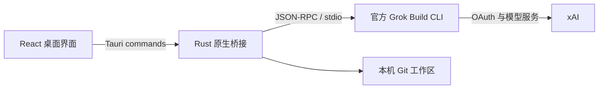

<p align="center">
  
</p>

<h1 align="center">GrokDesk</h1>

<p align="center">把官方 Grok Build 带进一个清晰、可审核的 Windows 桌面工作区。</p>

<p align="center">
  <strong>简体中文</strong> ·
  <a href="README.en.md">English</a> ·
  <a href="README.ja.md">日本語</a> ·
  <a href="README.ko.md">한국어</a> ·
  <a href="README.de.md">Deutsch</a>
</p>

<p align="center">
  <a href="https://github.com/Yueyuyu/grokdesk/releases/latest"></a>
  <a href="https://github.com/Yueyuyu/grokdesk/actions/workflows/ci.yml"></a>
  <a href="https://github.com/Yueyuyu/grokdesk/stargazers"></a>
  <a href="https://github.com/Yueyuyu/grokdesk/forks"></a>
  <a href="https://github.com/Yueyuyu/grokdesk/issues"></a>
  <a href="https://github.com/Yueyuyu/grokdesk/releases"></a>
  <a href="LICENSE"></a>
</p>

<p align="center">
  <a href="https://github.com/Yueyuyu/grokdesk/releases/latest"><strong>下载最新版</strong></a> ·
  <a href="#功能亮点">功能</a> ·
  <a href="#安装与首次启动">安装</a> ·
  <a href="#本地开发">开发</a> ·
  <a href="#当前限制与路线图">路线图</a>
</p>

<p align="center">
  
  
  
  
  
  
</p>

> [!IMPORTANT]
> GrokDesk 是独立、非官方的开源项目，与 xAI 不存在隶属、赞助或官方认可关系。“Grok”“Grok Build”和相关商标归其各自权利人所有。


## 为什么做 GrokDesk

Grok Build 的 Agent 能力来自官方 CLI；GrokDesk 不重新实现它。这个项目专注于补齐桌面使用体验：把任务历史、流式回复、计划、Tools、权限确认、Git 变更和终端上下文放进同一个三栏工作台，同时保留官方认证和运行时边界。

## 功能亮点

| 能力 | 当前行为 |
| --- | --- |
| 真实 ACP 会话 | 启动官方 `grok agent stdio`，支持 `session/new`、`session/load`、流式更新、取消和权限确认 |
| 后台 ACP 任务 | 最多保留 4 个任务级官方 Runtime 客户端：启动阶段串行以规避当前 CLI 的并发初始化阻塞，初始化后可并行运行；切换或新建任务不会中断输出，完成、失败和权限请求会在侧栏及可打开的通知中准确定位原任务 |
| 优化后的回答 | 安全渲染 GFM Markdown，包括标题、列表、任务列表、链接、表格、引用、行内代码和可复制代码块 |
| 稳定阅读体验 | 回答区独立顺滑滚动；用户上滚后不会被流式输出强行拉回，并提供“Back to latest” |
| 固定 Tools 底栏 | Tools 固定在输入框上方，默认展示最近 5 项，可展开查看完整活动 |
| 文件与图片 | 支持“＋”多选、拖放、缩略图、移除和仅附件发送；通过 ACP 图片或嵌入资源真实发送 |
| 工作区审核 | 显式选择项目文件夹，读取真实 Git 状态和统一 Diff，逐文件暂存、取消暂存或确认后回滚 |
| 真实工作区终端 | 在所选项目中运行 PowerShell，实时区分 stdout/stderr，支持历史命令、停止进程树，并保留独立 ACP 日志视图 |
| 后台终端与测试结果 | 最多 8 个独立终端标签可并行后台运行；支持新建、重命名、关闭和逐标签停止，并从真实 Vitest、Cargo、Jest、Node 输出提取通过数、失败数与耗时 |
| Runtime 与登录 | 首次启动可一键安装官方 Grok Runtime，并通过 `grok login --oauth` 登录 |
| Plugins 与 MCP | 从官方 Grok Runtime 读取并管理真实 Plugins、Marketplace 和 MCP 配置，不伪造本机状态 |
| Runtime 上下文与 Skills | 通过官方 `grok inspect --json` 读取当前工作区的项目指令、Skills、Agents 与配置层，并组合当前 ACP 会话报告的能力；支持刷新和重连 ACP，浏览器预览不伪造记录 |
| 模型与推理配置 | 只使用官方 ACP 初始化元数据展示模型、上下文窗口与推理强度，并通过官方 `--model`、`--reasoning-effort` 参数启动任务；已有对话的任务不会被静默重启 |
| 本机任务历史 | 按工作区保存任务、消息、计划、Tools 和 ACP Session ID；附件内容不会写入历史 |
| 任务生命周期 | 归档/恢复任务、创建不复用 ACP Session 的本地分支，并以经过 8 MiB 限制与结构校验的 JSON 显式导入/导出；凭据和附件正文不会进入文件 |
| 命令面板与跨任务搜索 | 按 `Ctrl+K` 搜索当前工作区的普通与归档任务，覆盖标题、对话、附件名、计划和 Tools，并运行导航、新建任务、切换工作区和检查器命令 |
| 权限中心与执行审计 | 按工作区记录经过脱敏的权限决定、Grok 工具生命周期和终端命令结果；支持筛选、搜索与确认清除，浏览器预览不生成模拟记录 |
| 诊断中心与问题报告 | 真实检查 GrokDesk、Runtime、OAuth、ACP、工作区/Git 与 MCP，并提供可执行修复入口和脱敏 Markdown 报告；浏览器预览不伪造健康数据 |
| 桌面体验 | 单实例、可调三栏、可折叠检查器、Light/Dark/System 主题和 Windows 桌面快捷方式 |

### 附件边界

- 最多 8 个附件，单个不超过 8 MiB，总计不超过 24 MiB。
- 图片使用 ACP `image` 内容块；文本与其他文件使用 ACP `resource` 内容块。
- GrokDesk 会读取当前 ACP 初始化结果中的 `promptCapabilities`。官方 Runtime 未公开对应能力时会明确报错，不会假装发送成功。
- 任务历史只保存附件名称、MIME 类型、大小和类别，不保存文件正文或 Base64 数据。
- 浏览器开发预览只演示交互，不会把附件发送到真实 Grok 账号。

## 安装与首次启动

Windows 用户可前往 [GitHub Releases](https://github.com/Yueyuyu/grokdesk/releases) 下载最新安装包。安装完成后会自动创建 GrokDesk 桌面快捷方式。

首次打开按界面完成以下步骤：

1. 点击 **Install Runtime**，由 GrokDesk 执行 xAI 官方 HTTPS 安装脚本。
2. 点击 **Sign in with Grok**，在系统浏览器中完成官方 OAuth。
3. 选择一个项目文件夹，然后创建或打开任务。
4. 如需订阅，在 Onboarding 或 Settings 中打开官方 SuperGrok 管理页。

不需要先手动下载或打开 Grok Build。OAuth 凭据始终由官方 CLI 管理，GrokDesk 不保存 Token。

> [!NOTE]
> 套餐和额度只在官方 CLI 实际返回 billing 数据时显示；否则 GrokDesk 会明确说明限制并提供官方管理入口，不会编造套餐或用量。

## 工作方式



原生端负责进程生命周期、ACP 消息、系统浏览器、Runtime 安装和 Git 操作；React 端负责任务、对话、Tools、附件、审核与设置界面。项目不会复制官方 Agent，也不会在仓库内实现另一套 Grok 服务。

## 本地开发

### 环境要求

- Windows 10/11
- Node.js 20+
- Rust stable（MSVC toolchain）
- Visual Studio 2022 Build Tools，勾选 **Desktop development with C++**
- WebView2 Runtime

### 启动

```powershell
npm ci
npm run tauri:dev
```

只预览 React 界面：

```powershell
npm run dev
```

浏览器预览会明确标记模拟的 Runtime、登录、Tools 和附件结果；本机文件、真实账号与真实 ACP 只在安装版/Tauri 开发版中访问。

### 校验

```powershell
npm test
npm run build
cargo check --manifest-path src-tauri/Cargo.toml
npm run tauri:build
```

安装包生成在 `src-tauri/target/release/bundle/`。

## 隐私与安全

- OAuth 凭据由官方 Grok CLI 保存和刷新。
- GrokDesk 不读取、不展示、也不持久化 OAuth Token。
- Runtime 安装仅在用户点击后执行官方 `https://x.ai/cli/install.ps1`。
- 只有用户显式选择的工作区会用于 ACP 和 Git 操作。
- 工作区终端只执行用户主动输入的命令；原始输出与结构化测试摘要仅保留在当前应用会话，不写入任务历史。
- 附件只在当前发送回合中编码；内容不进入 `localStorage` 任务历史。
- 任务 JSON 只在用户明确操作后导入或导出；文件可能包含对话、文件名和工作区路径，但不包含 OAuth/MCP 凭据、ACP Session ID 或附件正文。
- 命令面板只搜索当前工作区的本机任务；搜索词和结果不会上传到外部服务。
- 权限与执行历史仅在本机按工作区保存，最多保留 30 天和 500 条。终端输出、提示词、回复、附件正文、OAuth Token 与 MCP Header 不会进入审计记录，敏感命令参数会在持久化前脱敏。
- 诊断报告仅包含版本、平台、聚合计数和受控状态说明；绝对路径、账号标识、提示词、回复、终端输出、附件、OAuth 凭据以及 MCP 名称、端点和 Header 会被排除或脱敏。
- Context Inspector 只展示官方 Runtime 返回的安全投影；凭据值、绝对来源路径以及 MCP 名称、端点和 Header 不会进入前端数据。
- 模型配置只保存经过校验的模型 ID 与推理强度标识；模型目录来自官方 Runtime，浏览器预览不会伪造目录，也不会读取或保存账号凭据。
- 回滚文件始终要求二次确认，不执行自动批量回滚。
- Markdown 不启用原始 HTML，外部链接使用隔离的新窗口行为。

## 当前限制与路线图

- 当前优先支持 Windows；macOS 与 Linux 尚无正式安装包。
- 一键 Runtime 安装目前仅支持 Windows。
- 附件类型最终受已安装官方 Grok Runtime 的 ACP 能力约束。
- 套餐与额度受官方 CLI 是否提供 billing 接口约束。
- 终端当前运行非交互 PowerShell 命令，不提供完整 PTY/TTY 会话。
- Skills 当前在 Context Inspector 中为只读；官方 CLI 提供发现结果，但没有独立的 Skills 管理命令，安装与更新仍通过所属 Plugin 完成。
- 跨设备同步仍在后续路线中。

## 贡献

欢迎提交 Issue 和 Pull Request。请让每个 PR 聚焦一个逻辑改动，并在提交前运行相关测试与构建。安全问题请避免在公开 Issue 中附带 Token、账号信息或私有项目内容。

## 设计资料

- [视觉源图](docs/design/grokdesk-light-concept.png)
- [实现清单](docs/design/implementation-inventory.md)
- [视觉验收记录](design-qa.md)
- [Imagegen 资产说明](docs/design/imagegen-assets.md)

## License

[MIT](LICENSE)
